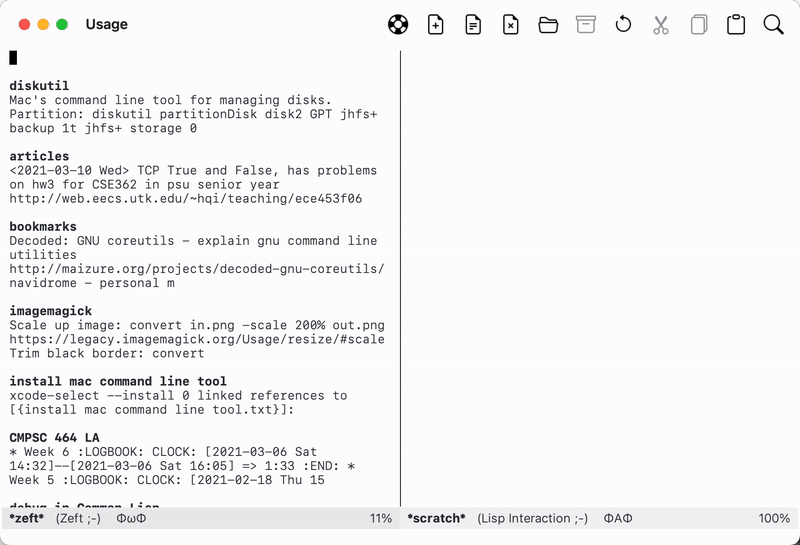

NOTE The primary repository is now at [SourceHut](https://sr.ht/~casouri/xeft).



# Usage

To use Xeft the note searching interface, install it and type `M-x
xeft RET` to bring up the panel. If the dynamic module doesn’t already
exists, you are prompted to download or compile it automatically. If
you choose to download the module, no more action is required. If you
want to compile the module locally, refer to the next section for
prerequisites for compiling the module.

Once the Xeft buffer is up, type the search phrase in the first line.
Press `C-n` and `C-p` to go through each file. You can preview a file
in another window by pressing `SPC` on a file, or click the file with
the mouse. Press `RET` to open the file in the current window.

Directory `xeft-directory` stores note files, directory
`xeft-database` stores the database. Xeft uses
`xeft-default-extension` to create new files, and it ignores files
with `xeft-ignore-extension`.

By default, Xeft only searches for first level files in
`xeft-directory`, to make it search recursively, set `xeft-recursive`
to t. Also beware that Xeft ignores search phrases shorter than three
characters, unless they are CJK characters.

See the “xeft” customize group for more custom options and faces.

# Queries

On search queries:

Since Xeft uses Xapian, it supports the query syntax Xapian supports:

```
AND, NOT, OR, XOR and parenthesizes
+word1 -word2      which matches documents that contains word1 but not
                   word2.
word1 NEAR word2   which matches documents in where word1 is near word2.
word1 ADJ word2    which matches documents in where word1 is near word2
                   and word1 comes before word2
"word1 word2"      which matches exactly “word1 word2”
```

Xeft deviates from Xapian in one aspect: consecutive phrases have
implied `AND` between them. So `word1 word2 word3` is actually seen as
`word1 AND word2 AND word3`.

See https://xapian.org/docs/queryparser.html for Xapian’s official
documentation on query syntax.

# Further customization

You can customize the following faces

- `xeft-selection`
- `xeft-inline-highlight`
- `xeft-preview-highlight`
- `xeft-excerpt-title`
- `xeft-excerpt-body`

Functions you can customize to alter Xeft’s behavior:

- `xeft-filename-fn`: How does Xeft create new files from search phrases.
- `xeft-file-filter`: Which files does Xeft include/exclude from indexing.
- `xeft-directory-filter`: When `xeft-recursive` is t, which
  sub-directories does Xeft include/exclude from indexing.
- `xeft-title-function`: How does Xeft find the title of a file.
- `xeft-file-list-function`: If `xeft-file-filter` and
  `xeft-directory-filter` are not flexible enough, this function gives
  you ultimate control over which files to index.

# Building the dynamic module

If the dynamic module is not installed yet, Xeft will automatically
prompt you to either download a prebuilt module or build the module
locally. Prebuilt modules don’t require xapian, but to build the
module locally and run it, you need to install xapian.

You can also build by command line:

```shell
make PREFIX=/opt/local
```

Here `/opt/local` is the default prefix of macports, which is what I
used to install Xapian. Homebrew and Linux users probably can leave it
empty.

I can’t test it but on windows you can get msys2 and
`mingw-w64-x86_64-xapian-core` and `make` should just work. Thanks to
pRot0ta1p for reporting this.

# notdeft

I owe many thanks to the author of notdeft. I don’t really know C++ or
Xapian, without reading his code I wouldn’t be able to write Xeft.

Also, if you want a more powerful searching experience, you will be
happier using notdeft instead.

# Xapian dynamic module

I wrote a xapian dynamic module that you can use too. Check it out at https://git.sr.ht/~casouri/xapian-lite

# Q & A

**Why do I still see files that should’ve been ignored after changing `xeft-ignore-extension`?**

You need to delete the database and let xeft rebuild it, because files
already included into the database are not automatically deleted.

**How to exclude a directory?**

You can customize `xeft-directory-filter` or `xeft-file-list-function`
to do it.

**How to use the file name as excerpt title instead?**

```emacs-lisp
(setq xeft-title-function #'file-name-nondirectory)
```

**How to include files in the subdirectories?**

```emacs-lisp
;; Don't follow symlinks.
(setq xeft-recusive t)
;; Follow symlinks.
(setq xeft-recusive 'follow-symlinks)
```

**How to make the preview pane to show up automatically?**

```emacs-lisp
(defvar-local xeft--displayed-by-xeft-p nil)

(defun xeft--eager-preview()
  (when-let* ((button (button-at (point)))
              (path (button-get button 'path)))
    ;; Kill previously displayed buffer.
    (when (window-live-p xeft--preview-window)
      (with-selected-window xeft--preview-window
        (when xeft--displayed-by-xeft-p
          (kill-buffer))))
    ;; Show preview of current selection.
    (xeft--preview-file path)))

(add-hook 'xeft-find-file-hook
          (lambda () (setq xeft--displayed-by-xeft-p t)))

(advice-add 'xeft-next :after #'xeft--eager-preview)
(advice-add 'xeft-previous :after #'xeft--eager-preview)
```
